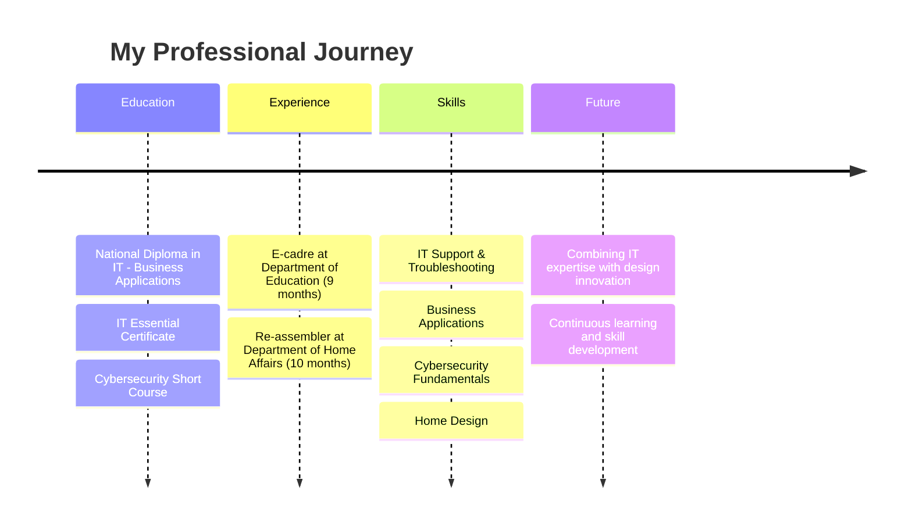

<div align="center">
  
</div>

<div align="center">
  <a href="https://www.linkedin.com/in/banele-mditshwa"></a>
  <a href="mailto:banelemzize@gmail.com"></a>
</div>

---

## 👨‍💻 About Me

```yaml
Name: Banele Mditshwa
Username: Ba9900
Location: Rustenburg South Africa
Education: 
  - National Diploma in Information Technology - Business Applications
  - IT Essential Certificate
  - Cybersecurity Short Course
experience:
  - E-cadre at Department of Education (9 months)
  - Re-assembler at Department of Home Affairs (10 months)
specialties:
  - IT Support & Troubleshooting
  - Business Applications
  - Cybersecurity Fundamentals
  - Home Design
interests: 
  - Technology Integration in Design
  - Process Optimization
  - Continuous Learning
```

I'm an IT professional with a passion for combining technical expertise with creative design solutions. With experience in government IT sectors and a background in home design, I bring a unique perspective to technology implementation that balances functionality with aesthetics.

## 🛠 Skills & Technologies

<div align="center">
  <h3>Technical Skills</h3>
  
  
  
  
  
  
  
  
  <h3>Design Skills</h3>
  
  
  
</div>

## 📊 GitHub Stats

<div align="center">
  
  
</div>

## 🚀 Featured Projects

<div align="center">
  <!-- Add your projects here, for example: -->
  <!--
  <a href="https://github.com/Ba9900/YOUR-REPO">
    
  </a>
  -->
</div>

## 📰 Professional Journey



## 📚 Currently Learning

- Advanced cybersecurity practices
- UI/UX design principles
- Full-stack web development
- Smart home technology integration

## 🤝 Let's Connect

I'm always interested in collaborating on projects that bridge technology and design. Feel free to reach out if you'd like to work together or just chat about innovative ideas!

<div align="center">
  
</div>
